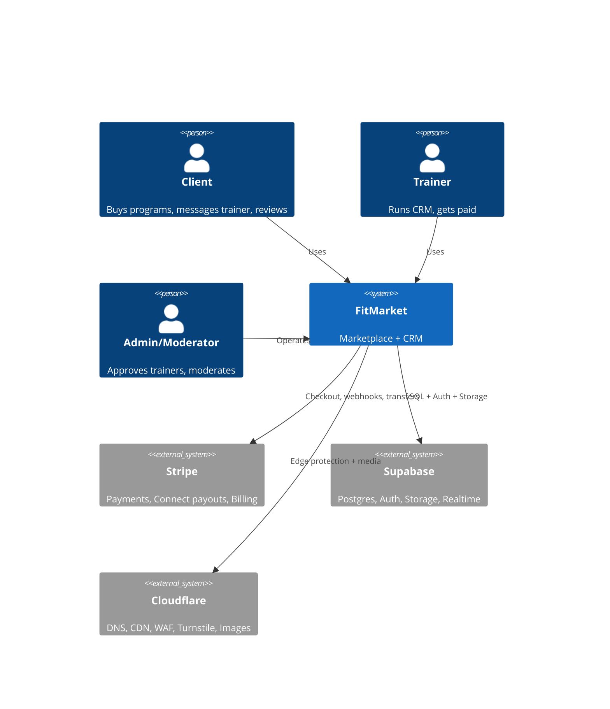
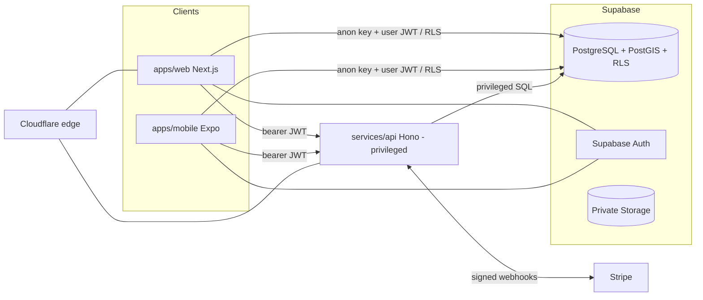
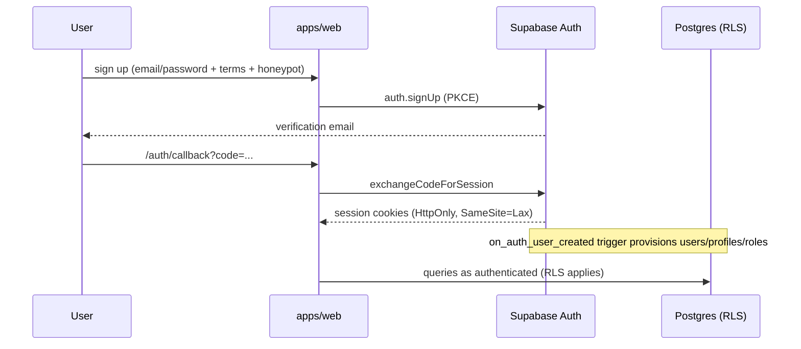
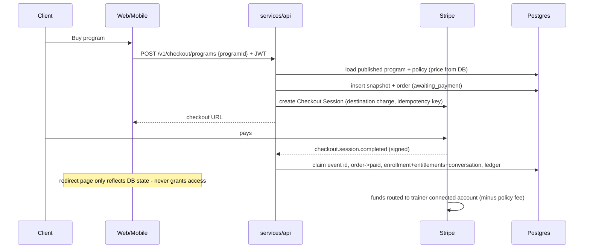
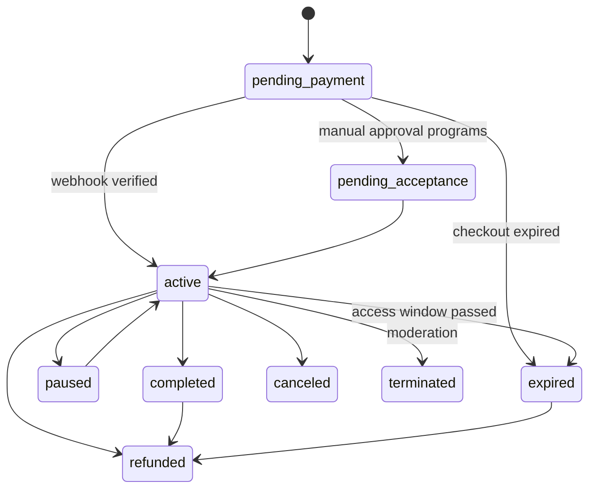
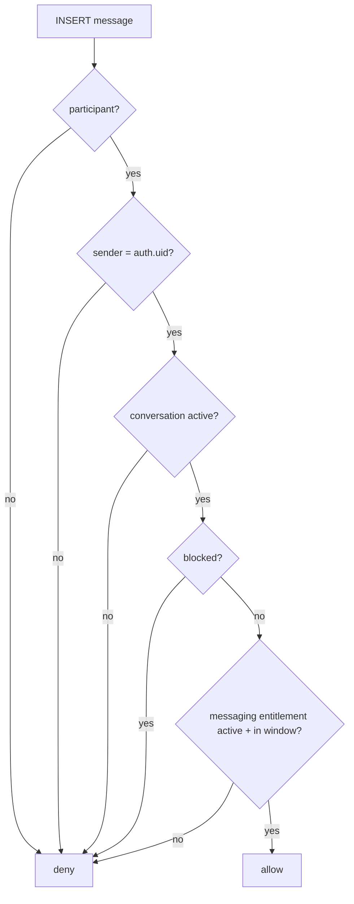
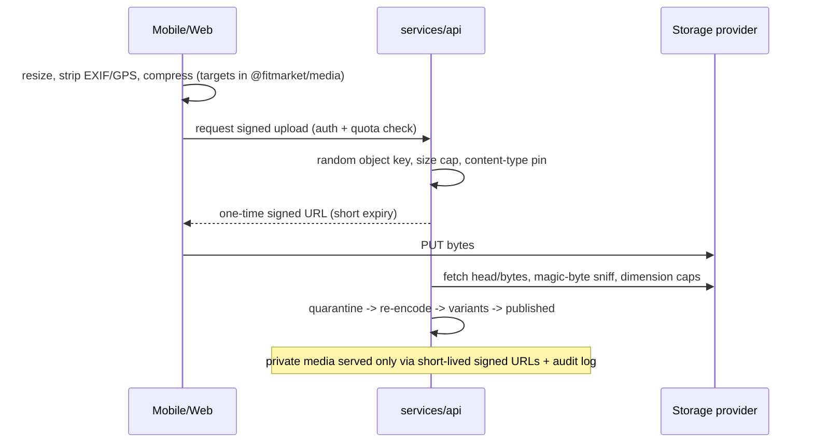

# Architecture

Modular monolith on managed services: one PostgreSQL database (Supabase) with RLS as the
database-level authorization boundary, one privileged API service for payments/billing,
and two clients (Next.js web, Expo mobile) that talk to Supabase with the anon key and to
the privileged API with user bearer tokens.

## System context

## Containers

Key decisions (full text in `docs/adr/`):

| ADR | Decision |
| --- | --- |
| 0001 | pnpm workspaces, no extra task runner until needed |
| 0002 | Plain-SQL forward-only migrations with our own runner + local Supabase shim |
| 0003 | RLS default deny + revoked client write privileges on financial tables |
| 0004 | Stripe Connect destination charges; policy-driven commission (default 0) |
| 0005 | Active-client billing via invoice items + append-only ledger |
| 0006 | services/api (Hono) instead of edge functions for payment paths |

## Authentication flow

## Client checkout & payout

## Enrollment state machine

Enforced in TypeScript (`@fitmarket/domain`) **and** by a database trigger.

## Geographic search

City text → server-side geocoding adapter → `app.search_trainers_nearby(lat, lng, radius)`
(SECURITY DEFINER SQL, GIST index, radius hard-capped at 160 km, page size ≤ 50, keyset
pagination on (distance, id)). Only coarse public points and area labels leave the
database; exact locations are owner-only rows.

## Trainer billing

See `docs/BILLING.md`. Subscription via Stripe Billing; the $2.50 active-client fee is
computed by a locked, idempotent job into `active_client_billing_ledger` (unique per
enrollment × period) and pushed as Stripe invoice items with deterministic idempotency keys.

## Messaging authorization

All checks run inside RLS policies/functions — the client cannot bypass them.

## Media upload

## Account deletion

Request → soft-mark → grace window → purge job anonymizes PII, deletes media, retains
financial records with redaction (legal basis documented in `docs/PRIVACY.md`), honors
legal holds.
