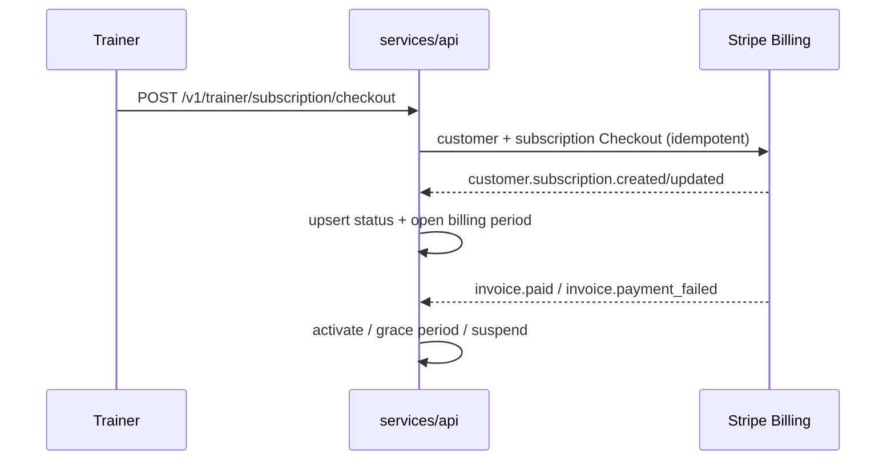

# Trainer billing

Two charges, both policy-driven from `trainer_billing_policy` (seeded: $34.99 subscription,
$2.50 active-client fee, 0 bps commission, 7-day grace period — **never hardcoded in
clients**):

## 1. Platform subscription — $34.99/month

Stripe Billing subscription (price lookup key `trainer_platform_monthly`).
`customer.subscription.*` webhooks maintain `trainer_subscription_accounts.status`
(`incomplete → trialing/active → past_due → grace_period → suspended → canceled`) and open a
`trainer_subscription_periods` row per Stripe period (unique on trainer + period_start).

Lifecycle handling:
- `invoice.payment_failed` → `grace_period`, `delinquent_since`, grace end from policy;
  Stripe smart retries drive dunning emails.
- Grace expiry (job) → `suspended`: public profile auto-unpublished (webhook handler),
  checkout for that trainer's programs is blocked (`trainer_not_ready`), CRM read access
  retained.
- `invoice.paid` → back to `active`, clears delinquency, finalizes invoiced ledger rows.
- Cancellation: `cancel_at_period_end` respected; immediate cancellation supported through
  the same webhook path.

## 2. Active-client fee — $2.50 per active client per billing cycle

**Definition (spec + `@fitmarket/domain` `isBillable`)**: an enrollment is billable for a
trainer billing period when it reached an accepted/paid status, its access window
(`actual_start_at` → `least(access_ends_at, refunded_at)`) overlaps ≥ 1 day of the period,
it wasn't fully refunded before access began, and it hasn't been billed for that period.

**Pipeline** (`/v1/jobs/active-client-billing`, cron + job token, idempotent):
1. Job lock row (`scheduled_job_runs` partial unique index) — no concurrent runs.
2. Per trainer with an **open** period and billable subscription status: SQL candidate scan
   → domain `computeBillableLineItems` (dedupes, applies rules) → insert
   `active_client_billing_ledger` rows `on conflict do nothing`.
3. **The invariant**: `acbl_once_per_period` unique index on (enrollment_id, period_start).
4. Stripe invoice item per row using the ledger's deterministic idempotency key
   (`acb:trainer:enrollment:periodStart`) → row `pending → invoiced`.
5. `invoice.paid` finalizes rows (`invoiced → finalized`); voids use `→ voided` with reason.

The ledger is append-only: identity/amount columns are immutable and DELETE is forbidden by
trigger even for the service role. Corrections are `voided` + a new row or a compensating
`payment_ledger` adjustment tied to an `admin_actions` record.

Counts are never accepted from clients; the job derives them from `enrollments` only.

Timezone/boundary rule: all periods and access windows are UTC timestamps supplied by
Stripe period boundaries; overlap uses half-open intervals `[start, end)` (boundary tests in
`packages/domain/test/billing.test.ts` and DB tests).

Failure handling: Stripe call fails → ledger row stays `pending`; the next run retries the
invoice item with the same idempotency key (no double charge). Webhook gaps are healed by
reconciliation comparing `invoiced` rows against Stripe invoice items.
