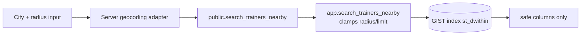

# Geographic search

## Design

- Trainer locations are PostGIS `geography(point, 4326)` columns:
  - `public_point`: coarse city-level point used for search (safe to rank on).
  - `exact_location` / `exact_address`: private, owner-only rows under RLS; never returned
    by any public path (tested).
- Search entry points are SECURITY DEFINER SQL functions with **server-side clamps**:
  radius ≤ 160 km (100 mi), page size ≤ 50, stable keyset pagination on
  `(distance_m, trainer_id)` — the caller cannot exceed them regardless of parameters.
- `st_dwithin` on the GIST index (`trainer_service_locations_public_point_gist`) does the
  radius filter; a `distinct on (trainer_id)` keeps the closest of multiple service cities.
- Results expose only: display name, headline, slug, service mode, `service_area_label`,
  city name, distance, rating aggregates.

## Geocoding

City text is resolved **server-side**. Launch build ships a static launch-city table
(no external calls); the production adapter contract (packages/media-style provider
interface, to be added with the external provider) requires: allowlisted host, no
redirect following, timeouts, response schema validation, and caching by normalized city —
user text is never a URL component without encoding + allowlist. Radius options in the UI:
5/10/15/25/50/100 miles (km configurable).

## Ranking

In-person: distance ascending (stable tiebreak on id). Online: `0.6 × weighted_rating/5 +
0.4 × text relevance` where weighted_rating is the Bayesian-smoothed aggregate
(prior m=3.5, C=5) — one 5★ review cannot dominate (tested). No paid manipulation exists;
if sponsored placement ships (feature flag `sponsored_placement`), results must be labeled.

## Performance

- EXPLAIN test asserts index usage; k6 scenarios for search live in `docs/TESTING.md`
  targets (p95 < 800 ms initial load).
- Public online-search responses are safely cacheable for short TTLs at the CDN (no
  user-specific data); nearby search is cacheable keyed on rounded origin + radius.
